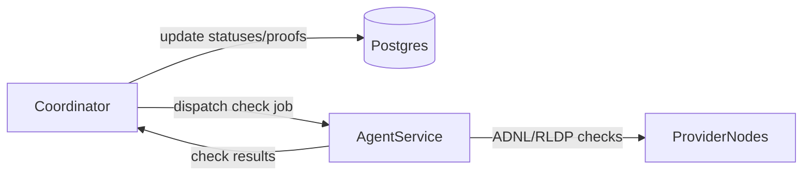

# План этапа: вынести тяжелые операции во второй микросервис

## Цель текущего этапа

- Не переписывать систему целиком.
- Сохранить текущий сервис почти без изменений по внешнему поведению.
- Вынести только тяжелую сеть/проверки провайдеров в отдельный сервис-агент.
- Сделать второй сервис архитектурно похожим на первый: `cmd`, `config`, health endpoint, structured logs, запуск как отдельный процесс.

## Что остается как есть (координатор)

- Текущий основной процесс в [`cmd/main.go`](cmd/main.go): HTTP API, метрики, подключение к Postgres, текущие воркеры.
- Все существующие репозитории и запись в БД через [`pkg/repositories/providers`](pkg/repositories/providers).
- Воркеры, не относящиеся к тяжелому provider proof path (`telemetry`, `cleaner`, агрегаты/рейтинг), если не требуется иное.

## Что выносим в агент (минимальный скоуп)

Источник для выноса: [`pkg/workers/providersMaster/worker.go`](pkg/workers/providersMaster/worker.go).

- Тяжелая часть из `StoreProof`, где происходят сетевые проверки провайдера:
  - `checkProviderFiles`
  - `checkPiece`
  - все связанные ADNL/RLDP запросы к `ip:port` провайдера.
- В агент передается только необходимый input (provider endpoint, pubkey, bag/contracts payload).
- Агент возвращает нормализованный результат проверок (reason/status + идентификаторы контракта/провайдера), без прямой записи в БД.

## Архитектура этапа (минимальный target)

## Минимальные изменения в коде

- **Координатор**
  - В `providersMaster.StoreProof` заменить прямой запуск тяжелых проверок на dispatch в агент.
  - Полученный ответ агента маппить в текущие структуры `db.ContractProofsCheck` и писать через уже существующие методы репозитория.
  - Логи координатора: `job_id`, `agent_id`, `provider`, `duration`, `result_count`.

- **Агент**
  - Новый `cmd` для второго сервиса (похожая структура запуска на основной сервис).
  - Свой `config` (URL координатора, токен, таймауты, уровень логирования, ADNL-параметры если нужны).
  - Минимальный HTTP сервер: health + endpoint выполнения check job.
  - Переиспользование вынесенной heavy-логики из `providersMaster` через общий пакет.

## Контракт coordinator-agent (MVP)

- `POST /internal/v1/jobs/provider-check`
  - request: job metadata + provider/contracts payload.
  - response: список результатов проверок + ошибки per item.
- `GET /health` у агента.
- Auth: простой статический токен (header).
- Таймауты и retry в координаторе: ограниченное число попыток, без полной очереди на этом этапе.

## Bash-скрипт для установки агента (только агент)

- Установить зависимости рантайма (минимум).
- Скачать/разместить бинарь агента.
- Создать сервисного пользователя и директорию конфигурации.
- Положить `.env`/config для агента.
- Создать и включить systemd unit.
- Проверить `systemctl status` и `curl /health`.

## План изучения перед реализацией (краткий)

- [`cmd/main.go`](cmd/main.go), [`cmd/config.go`](cmd/config.go), [`cmd/init.go`](cmd/init.go) — как сейчас стартует сервис.
- [`pkg/workers/providersMaster/worker.go`](pkg/workers/providersMaster/worker.go) — точно выделить heavy path.
- [`pkg/repositories/providers`](pkg/repositories/providers) — понять формат результатов для БД без изменения схемы.

## Definition of done для текущего этапа

- Координатор запускается и выглядит как раньше (API/метрики/основные воркеры не сломаны).
- Тяжелые provider checks выполняются агентом на отдельной машине.
- Координатор получает результаты и пишет в текущую БД теми же репозиториями.
- Есть рабочий скрипт установки агента на свежую VPS.
- Есть end-to-end лог-трасса (debug) по одному job: coordinator dispatch -> agent check -> coordinator persist.
